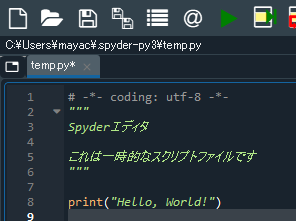
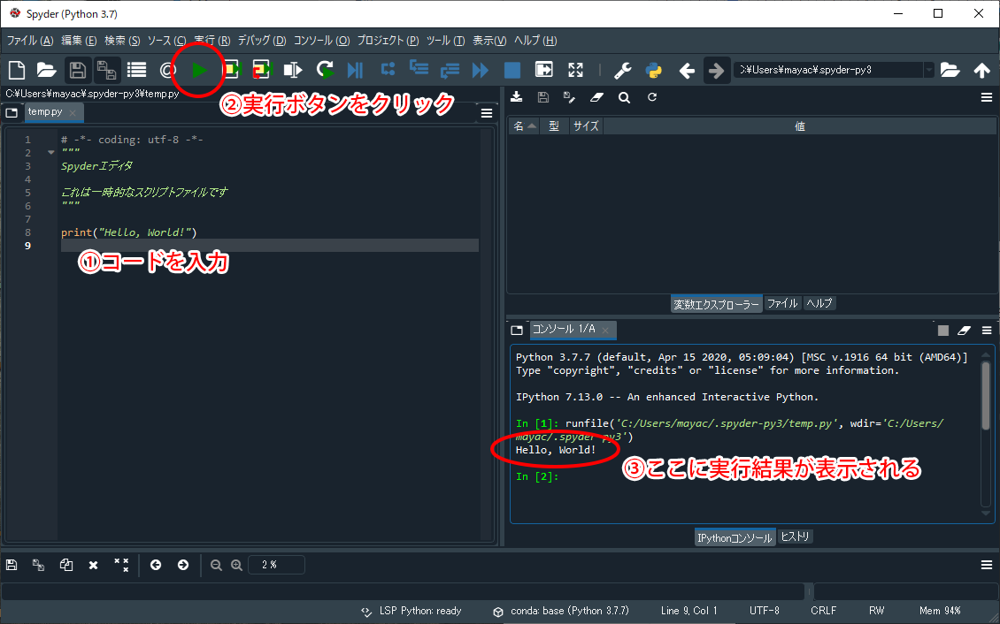

# 開発環境のインストール ～ ハローワールド

[< 戻る](../)

## 開発環境のインストール

いざ Python をやってみよう！と思い立ってWEBで色々と検索してみると、まずは「統合開発環境」や「開発環境」と呼ばれるものが必要であることが分かります。しかし情報が多すぎて、どの開発環境で始めるのがよいか迷ってしまうこともあると思います。

本授業では初心者にも分かりやすいと言われている「Spyder」という開発環境を使用していこうと思います。Spyder をインストールするには、まず Anaconda というものをインストールする必要があります（※いきなりややこしそうですが大丈夫です！）。Anaconda とはいくつかのソフトウェアや追加機能の集合体、です。Anaconda をインストールすることで Spyder や追加機能がインストールされる、という流れです。

以下のリンクに Anaconda のインストール ～ Spyder の起動方法をまとめてみましたので、早速自分の WindowsPC・Mac にインストールしましょう。

**※（重要）Spyderは、アップデートしないでください。**Spyder 起動時に、「Spyder 5.0.0 にアップデート出来ます」といったメッセージが表示されることがありますが、Spyder 5.0.0 は動作が不安定との情報がありましたので、今回はアップデートせずに学習を進めることにします。

**[Windows へのインストールと起動方法](./anaconda_win)**

**[Mac へのインストールと起動方法](./anaconda_mac)**


## ハロー・ワールド　簡単なコードを書いてみよう

コードというのはプログラミングをする際に書く命令文のことです。ソースコードとも言います。

まずは Spyder の使い方説明も兼ねて、コンソール（Spyder 画面の右側下段）に“Hello, World!”というごく簡単な文字を表示させるコードを書いてみましょう。この“Hello, World!”を表示するコードは通称ハロー・ワールドと呼ばれ、どのプログラミング言語においてもまず初めにやってみる、というのが慣習となっています。


### エディタにコードを入力

以下のコードをエディタ（Spyder 画面の左）に入力します。

```python
print("Hello, World!") 
```

実際に入力してみた画面です。
エディタの１～６行目に何やら記述がありますが、とりあえず無視しておいて大丈夫です。



### 実行

入力したら、画面上部に並んだアイコンから再生ボタンのような “ファイルを実行” アイコン  を探し、クリックしてみましょう。
すると、画面右下のコンソールに「Hello, World!」と表示されました。




### 解説

ハロー・ワールドのコードは「print("Hello, World!")」だけでしたのでとても簡単ですね。このコードのポイントは２つです。

ポイント１
print() という命令でコンソールに表示させます。括弧の中身が表示されます。

ポイント２
文字（文字列）は ダブルクオーテーション「"」もしくは シングルクォーテーション「'」で囲みます。
"Hello, World!" もしくは 'Hello, World!' のように記述します。

 ※シングルクォーテーション 「'」 に似ている記号でバッククォート 「`」 というものがあります。間違えやすいので注意しましょう。


### 練習

Hello, World! 以外の文字を表示させてみましょう。日本語でも大丈夫です！


### ハロー・ワールドってなあに？

ハロー・ワールド は画面に「Hello, World!」と表示させるだけのごく簡単なコードのことです。少しでも何かしらのプログラミング言語を勉強したことがある人なら必ずと言っていいほど経験していると思います。
C言語というプログラミング言語が現在のようなプログラミング言語の元と言われていますが、1978年に刊行されたC言語の本「プログラミング言語C」で初めて Hello world が出てきます。当時は大文字や感嘆符を入れずに hello, world という表示でした。
それ以来、どのようなプログラミング言語を学ぶ際にもまずはハロー・ワールドをやってみる、という習慣が出来たと言われています。


 C言語におけるハロー・ワールド
PythonはC言語よりシンプルであることが分かります。


## 電卓替わりに使ってみる

Python を電卓のように使ってみましょう。


### エディタにコードを入力

先ほどのハロー・ワールドの下に適当な足し算を入力してみましょう。

```
print(16+43) 
```

実際に入力してみた画面です。


### 実行

入力したら、先ほどと同じく画面上部の “ファイルを実行” アイコン  をクリックしてみましょう。

すると、画面右下のコンソールに「"Hello, World!"」と「59」表示されるかと思います。再生ボタンをクリックするとエディタに記述してある全てのコードを実行してしまいます。もしエディタに記述したコードの一部だけを実行したい場合はその行を選択し、画面上部から “選択範囲あるいは現在行を実行” アイコン  を探してクリックしてみましょう。コンソールには計算結果だけが表示されるはずです。


### 解説

print()はハロー・ワールドでも出てきましたが、この命令によって計算結果がコンソールに表示されます。ハロー・ワールドの場合は「文字列」を表示したのに対し、今回は「数字」を表示した、というところがポイントです。
また、足し算以外にも様々な計算を行うことが出来ます。四則計算（足し算、引き算、掛け算、割り算）の他にも〇〇の〇乗といった計算や、割り算のあまりを求めることも出来ます。

|              | 数学での書き方の例 | Python での書き方 |
| ------------ | ------------------ | ----------------- |
| 足し算       | 3＋4               | 3+4               |
| 引き算       | 10－6              | 10-6              |
| 掛け算       | 5×6                | 5*6               |
| 割り算       | 8÷4                | 8/4               |
| 〇〇の〇乗   | 3 2                | 3**2              |
| 割り算の余り | 7÷3 の余りは 1     | 7%3               |


### 練習

解説で出てきた計算方法を全てやってみましょう。


## カレンダーを表示してみる

Python では様々な機能を比較的簡単な命令で使うことができます。ここではカレンダーの機能を呼び出して表示する、ということをやってみましょう。


### エディタにコードを入力

以下の2行をエディタに入力します。

```
import calendar
print(calendar.month(2020, 5)) 
```

実際に入力してみた画面です。
今回は先ほど入力したハロー・ワールドや電卓は削除してありますが、残っていても問題ありません。


### 実行

入力したら、先ほどと同じく画面上部の “ファイルを実行” アイコン  をクリックしてみましょう（もしくは入力した2行を選択し、“選択範囲あるいは現在行を実行” アイコン  をクリックします）。
するとコンソールに2020年5月のカレンダーが表示されるはずです。


### 解説

Python では様々な機能を追加し、使用することが出来ます。今回、簡単な命令でカレンダーの表示が出来たのは、１行目でカレンダーの「モジュール」を Python に取り込んだからです。 このように機能を追加するためには「モジュール」「パッケージ」「ライブラリ」といったものを用います。これらの違いについては今は説明しませんが、これらの言葉が出てきたら「何かの機能を追加してるんだな」という風に考えてください。


### 練習

自分の誕生月のカレンダーを表示し、何曜日に生まれたか調べてみましょう。

コードを以下のように変更して実行してみましょう。どのように表示されましたか？

```
import calendar
print(calendar.calendar(2020))
```


---

初回の授業でしたが盛りだくさんな内容となってしまいました。
本日で一番重要なポイントは「開発環境のインストール」ですが、無事にインストールや起動はできたでしょうか？
どうしてもインストール方法が分からない、インストールは出来たけど立ち上がらない、などありましたら Teams から質問を受け付けていますので、気軽に掲示板に書き込んだりメールを送ってみてください。

次回の授業も、本格的な内容に入る前の準備が主になります。
WEBテキストは次週頭にはアップ予定です。

[< 戻る](../)