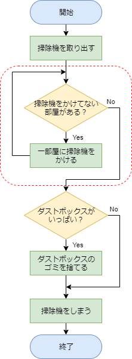
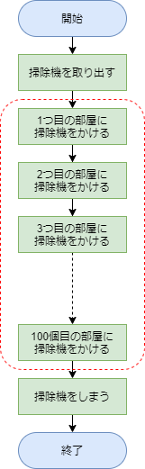
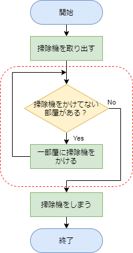
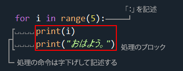
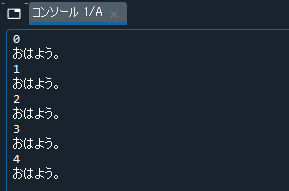
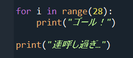
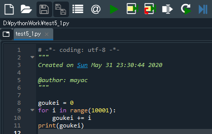
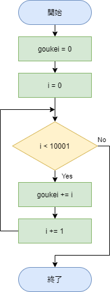
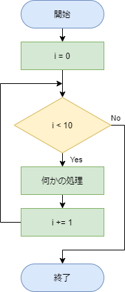
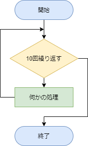

# 条件分岐と繰り返し２

[< 戻る](../)

　

この授業で習得してほしい５つの項目「変数」「順次処理」「条件分岐」「繰り返し」「関数」のうち「繰り返し」を学習します。

「繰り返し（ループ）」は Python だけでなく、あらゆるプログラミング言語を学習するにあたって必ず覚えなくてはならない必須項目です。
「条件分岐」と「繰り返し（ループ）」さえ覚えれば、どんな複雑な処理も記述できると言われていますので、早速学習していきましょう！


授業を４回繰り返すの図


## 繰り返しってなあに？

第２回の授業のフローチャートの学習で、「部屋を掃除する」という例を見てみました。



このフローチャートの赤い点線で囲われた箇所を見てみると、ひし形のブロックで「掃除機をかけてない部屋がある？」と書かれています。

この家には4部屋あり、まだ1部屋も掃除機をかけていないとします。
すると「掃除機をかけていない部屋がある？」に対する答えはYesですので、「一部屋に掃除機をかける」という行動（処理）を取ります。これで残りの部屋数は3部屋ですね。

矢印をたどると再び「掃除機をかけていない部屋がある？」というひし形ブロックにたどり着きます。
まだ3部屋に掃除機をかけていませんので再びYesの矢印に進み、一部屋に掃除機をかけます。

これを全部で4回繰り返すと、全ての部屋に掃除機をかけたことになります。
したがって、条件分岐のひし形ブロックからNoの矢印に進み、次の行動（処理）に移ることが出来ます。

このように、コンピュータに一定回数同じ処理をさせることが「繰り返し」です。あるいは「ループ」と言います。
4部屋程度なら繰り返しの記述をしなくても、順次処理の記述方法だけで書けるかもしれません。
しかし、100部屋だとすると順次処理ではとても書ききれません。

（左）順次処理だけで記述　　（右）ループを使って記述





例えば画像処理をさせる際などは、ある処理を数万回繰り返す、といったことが多々あります。
とても順次処理では追いつきませんね。

それでは具体的にコードをどう書いていくのかを見ていきましょう。


## 繰り返し（ループ）の書式１

繰り返し（ループ）を記述する方法はいくつかありますが、最も多用するのは「for」を使って記述する方法です。「for」を使って記述した部分は for文と呼ばれます。


まずは「〇回繰り返す」の記述方法です。

上記の例では、処理のブロックを5回繰り返して処理します。
実行してみましょう。


コンソールにはこのように表示されます。

「おはよう。」が5回表示されているのは、「5回繰り返してるんだからそりゃそうでしょ。」となると思いますが、それと同時に 0 ～ 4 の数値も表示されています。

このコードでは1行目と2行目に「`i`」という文字が出てきていますが、これは変数です。
つまり繰り返すたびに、「今何回目の繰り返しですよ」という情報が「`i`」に代入されているのです。
**コンピュータの場合、始まりの数は0としますので、表示されるのは 1 ～ 5 ではなく、0 ～ 4 となっています。** 

そういえば第３回のテキストで出てきた「リスト」のインデックスも 0 スタートでしたね（忘れちゃった方はテキストを読み返しておいてください）。
なお慣例的に「`i`」を用いることが多いのですが、特に「`i`」である必要もないので、以下のようにしても大丈夫です。

```python
for abc in range(5):
    print(abc)
    print("おはよう。")
```

〇回繰り返す、という処理の時にはこの書き方をしますので、まずはこのまま覚えちゃうことをお勧めします。


### 字下げについて復習

前回の条件分岐の授業でも出てきましたが、大切なことなのでしつこく書いておきます！
Python における字下げはとても重要です。なぜなら Python では同じ数の空白で字下げされたまとまりを、一つのブロックとして認識するためです。



したがってこの例の場合、2行目までが for文であり、繰り返し処理が行われるのは字下げされている「print( "ゴール！" )」の部分だけです。
最後の行は字下げされておらず、for文の外に記述されていますので、28回の繰り返しの後に1回だけ「連呼し過ぎ…」と表示されます。

字下げは「if文」や「for文」や「関数」などにも使われています。色々なルールがありますが、実際にコードを記述しながらしっかりと覚えていきましょう。

なお、Python 以外のプログラミング言語もよく字下げしているのですが、特に何の意味もありません。単にコードを見やすくするためだけに使われていますので、字下げしていてもしていなくても、実行の際に挙動が変わることはありません。


## 1+2+3+....+10000 を計算させてみよう

まずはコンピュータの速度を実感してもらうために、1～10000 の整数を全て足し合わせた合計を求めてみましょう。先ほど「`i` は 0 から始まる」ということでしたので、1～10000 の足し算を行うにはどうすればよいでしょうか？


#### エディタにコードを入力


まず、Spyder の画面左上にある“新規ファイル”アイコンをクリックし、新しい Python ファイルを用意します。


以下のコードを入力し、ファイルを保存アイコンをクリックして保存しましょう。今回は `test5_1.py` という名前で保存してみました。

```python
goukei = 0
for i in range(10001):
    goukei += i
print(goukei)
```




#### 実行


入力したら、画面上部の“ファイルを実行”アイコンをクリックしてみましょう。

ほんの一瞬でコンソールに合計値「50005000」が表示されたかと思います。あっという間ですね。


#### 解説

この for文における変数 `i` は 0～10000 の 10001個の整数となります。`i` は 0 スタートですので、10000 まで足したいを思ったならば range(10001) という感じで+1した値を指定する必要があります。

このコードでは 0 という整数が入った `goukei` という変数をあらかじめ用意し、そこにどんどん変数 `i` の値を追加しています。

```python
goukei += i
```

という部分が追加処理です。ちょっと見慣れない書き方ですよね。
例えば変数 a に 10 という値が入っていたとします。
`a += 5`
という処理を実行すると、a の値は 15 になります。
この表記方法は他のプログラミング言語でもよく使いますので、覚えておきましょう。
なお、+= 以外にも以下のような表記もあります（表記方法１と表記方法２は同じことですので、使いやすい方を使うので大丈夫です）。

a = 10 とした場合…

| 記述方法１          | 記述方法２ | 結果      |      |
| ------------------- | ---------- | --------- | ---- |
| a に 5 を足したい   | a += 5     | a = a + 5 | 15   |
| a から 5 を引きたい | a -= 5     | a = a - 5 | 5    |
| a に 5 を掛けたい   | a *= 5     | a = a * 5 | 50   |
| a を 5 で割りたい   | a /=5      | a = a / 5 | 2    |

コードの各行の内容とフローチャートの例は次のようになります。

```python
goukei = 0              # 合計値を入れる変数を用意しておく 値は0
for i in range(10001):  # 10001回の繰り返し 変数iは繰り返すごとに0,1,2 … 10000と変化していく
    goukei += i         # 変数 goukei に変数 i の値を追加していく
print(goukei)           # 最後に合計値をコンソールに表示
```




#### 練習

〇回繰り返す、というフローチャートは例えば以下のように書くことができます。自分好みの書き方を見つけて、パッと書けるように覚えてしまいましょう！

（左）コードに忠実に書いてみた例　　（右）簡単に書いてみた例





先ほどのコードでは 1～10000 の整数すべての合計値を計算させました。一瞬で計算できたと思います。
それでは 1～10000000（1000万）の整数全ての合計値ではどうでしょうか？こちらもかなりのスピードで計算できるはずですので、試してみてください。

1～10 までの整数値をすべてかけ合わせる計算をさせるにはどうすればよいでしょうか？
繰り返し（ループ）の記述を用いてコードを作成してみてください。 

<details><summary><u>→解答例を表示</u></summary><blockquote><span class="md-text">
1～10の整数値を全て掛けた値を計算させます。
以下、解答例となります。
<br>このフローチャート（左）を元に、elif を使ってコードを書いていきます。
<pre><code class="python">ans = 1                 # 答えを入れる変数を用意しておく 値はあらかじめ 1 を入れておく
for i in range(10):     # for文 10回繰り返す
    ans = ans * (i + 1) # iは0,1,2, … 8,9という値を取るため(i+1)とすることで1～10になる
print(ans)              # 結果を表示</code></pre>
<掛け算の場合、0 を掛けてしまうとダメですので i に 1 を足してあげる必要があります。
また、答えを入れる変数も最初に 0 を入れてしまうと何をかけても 0 ですので、1 を入れておきましょう。
3628800 と表示されれば正解です。

なお、3行目の「 ans = ans * (i + 1) 」は、「 ans *= (i + 1) 」と書いてもOKです。


まったくの余談ですが 1 ～ n までの整数値を全て掛け合わせたものを「階乗」といいます（高校の数学でやった人もいるかもしれません）。
階乗は n! と表記しますので、今の場合は 10! と表記します。
<hr></span></blockquote></details>


#### エディタにコードを入力


まず、Spyder の画面左上にある“新規ファイル”アイコンをクリックし、新しい Python ファイルを用意します。


以下のコードを入力し、ファイルを保存アイコンをクリックして保存しましょう。今回は `.py` という名前で保存してみました。

```python

```


#### 実行


入力したら、画面上部の“ファイルを実行”アイコンをクリックしてみましょう。


#### 解説


#### 練習

　

[< 戻る](../)