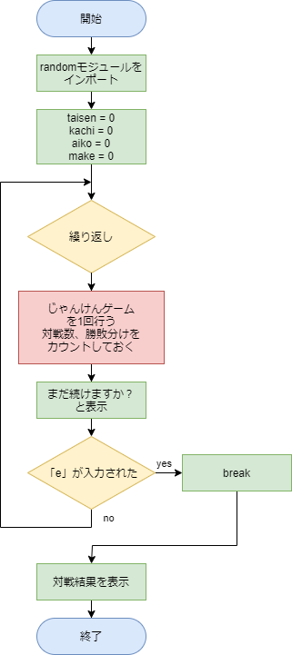

# 解答例と解説：無限じゃんけんゲーム

[< 戻る](../)

　

問題４ではじゃんけんゲームを作成してみました。

ただし1回きりのじゃんけんゲームでしたので、やめない限りはずっと続けることができるじゃんけんゲームに改良してみましょう。
先ほどのコードを無限ループの中にそっくり入れてあげることでじゃんけんゲームを無限に続けられるようになります。
簡単なフローチャートを考えてみましょう。

（ちゃんと書くと長くなるため、じゃんけん１回分のフローチャートは赤のボックスにまとめて表記してみました。）




　

以上をコードにしてみると、例えば以下のように書くことができます。
今までに比べると長くて複雑なコードに感じますが、一つ一つ見ていくと、すべて今までに学習した項目の組み合わせであることが分かるかと思います。

```python
import random                                                          # randomモジュールをインポート
taisen = 0                                                             # 対戦数記録用のint型変数を作成
kachi = 0                                                              # 勝ち回数記録用のint型変数を作成
aiko = 0                                                               # あいこ回数記録用のint型変数を作成
make = 0                                                               # 負け回数記録用のint型変数を作成
                                                                       #  
while True:                                                            # whileによる無限ループ
    taisen += 1                                                        # 対戦数をプラス１
                                                                       #  
    while True:                                                        # whileによる無限ループ
        print("じゃんけんの手は何にしますか？")                            #  
        print("グーなら「g」チョキなら「c」パーなら「p」を入力してください。")#  
                                                                       #  
        te_a = input()                                                 # 入力した文字列を te_a に代入
        te_b = random.choice(["g", "c", "p"])                          # 相手の手をランダムに te_b に代入
                                                                       #  
        if te_a == te_b:                                               # te_a と te_b が同じ場合は…
            print("あいこです。")                                        #  あいこです。
            aiko += 1                                                  #  あいこの数を記録
        else:                                                          # そうではなくて…
            if te_a == "g" and te_b =="c":                             # 自分：グー 相手：チョキ ならば…
                print("あなたの勝ち！")                                  #  あなたの勝ち！
                kachi += 1                                             #  勝ち数を記録
            if te_a == "g" and te_b == "p":                            # 自分：グー 相手：パー ならば…
                print("あなたの負け…")                                   #  あなたの負け…
                make += 1                                              #  負け数を記録
            if te_a == "c" and te_b =="p":                              # 自分：チョキ 相手：パー ならば…
                print("あなたの勝ち！")                                  #  あなたの勝ち！
                kachi += 1                                              #  勝ち数を記録
            if te_a == "c" and te_b == "g":                            # 自分：チョキ 相手：グー ならば…
                print("あなたの負け…")                                   #  あなたの負け
                make += 1                                              #  負け数を記録…
            if te_a == "p" and te_b =="g":                             # 自分：パー 相手：グー ならば…
                print("あなたの勝ち！")                                  #  あなたの勝ち！
                kachi += 1                                             #  勝ち数を記録
            if te_a == "p" and te_b == "c":                            # 自分：パー 相手：チョキ ならば…
                print("あなたの負け…")                                   #  あなたの負け…
                make += 1                                               #  負け数を記録
            break                                                       # ループ脱出
                                                                       #  
    print("続けますか？やめる場合は「e」続ける場合はその他のキーを押してください。") #  
    if input() == "e":                                                 # 入力された文字列が「e」ならば…
        break                                                          #  ループ脱出
                                                                       #  
print(taisen, "回対戦しました。")                                        # 結果表示
print(kachi, "勝", make, "敗です。あいこは", aiko, "回ありました。")
```


　

[< 戻る](../)