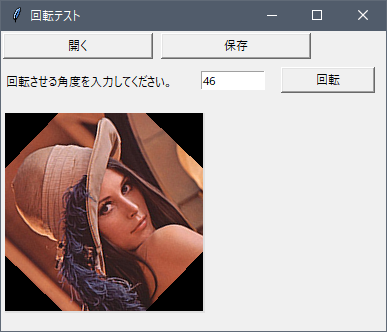
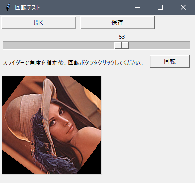

# 第11回の課題

[< 戻る](../)

## 画像回転ツールを作る

テキストの例題「読み込んだ画像を回転し、保存してみよう」ではテキスト入力欄に角度を入力し、回転させました。

このコードを修正し、

- **回転角度をスライダーで指定して、（-180度～180度までを１度単位で指定できるように）**
- **「回転」ボタンをクリックすると画像が回転し、**
- **「保存」ボタンで画像が保存できる**

**というGUIに変更してください。**

以下の図を参考にしてみてください（各部品の配置は自由にアレンジしてください）。

　

コードが完成したら実行し、**ツールとSpyderのスナップショットをそれぞれ撮って**、課題に添付されているパワーポイントに貼り付けて提出してください。

今回はコードが長いので、コードを貼り付ける必要はありません。

　

[< 戻る](../)